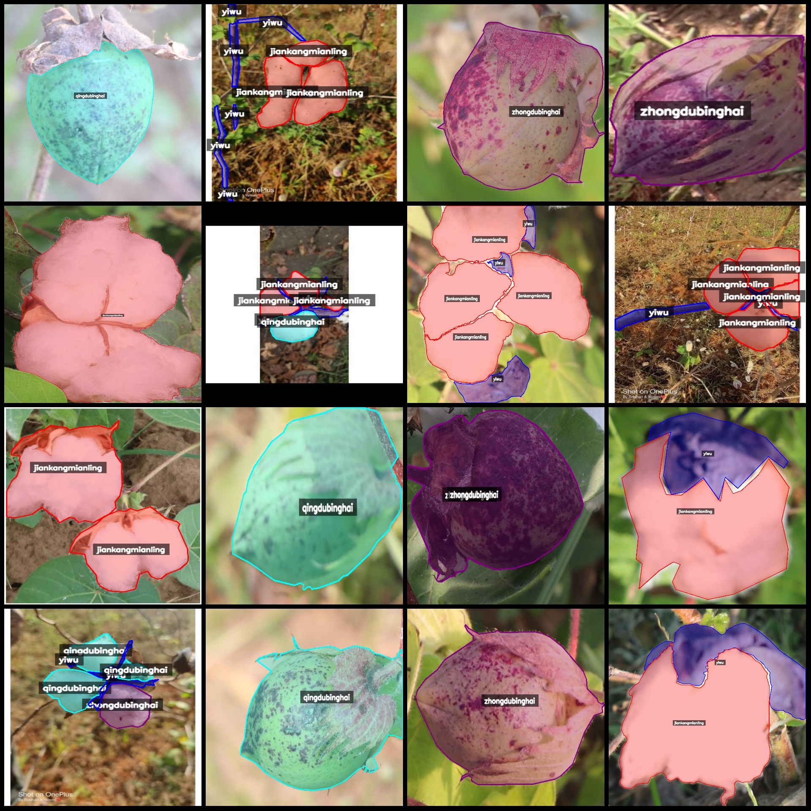
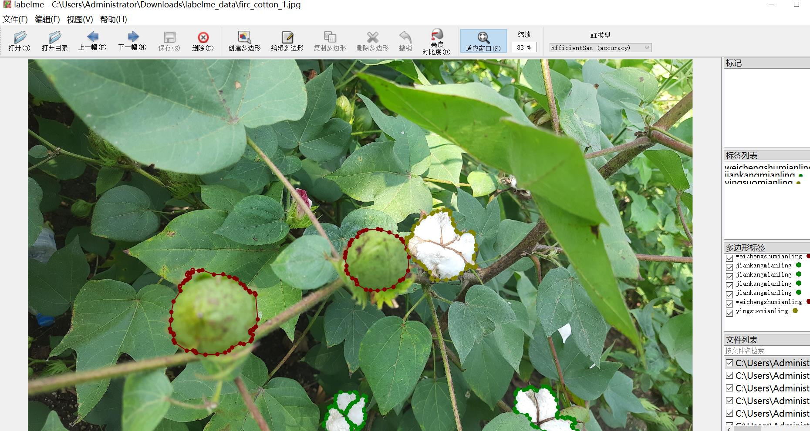

# Smart Agriculture Cotton Boll Disease Maturity Identification and Segmentation Dataset - LabelMe Format: 969 Images, 6 Categories

Dataset format: LabelMe format (without mask files, only containing JPG images and corresponding JSON files)
Number of images (JPG file count): 969
Number of annotations (JSON file count): 969
Number of annotation categories: 6
Annotation category names: ["jiankangmianling", "qingdubinghai", "weichengshumianling", "yingsuomianling", "yiwu", "zhongdubinghai"]
["Foreign Objects", "Hard Lock Cotton Seeds", "Unripe Cotton Seeds", "Mild Disease", "Severe Disease", "Healthy Cotton Seeds"]
Number of boxes per category:
jiankangmianling count = 1513
qingdubinghai count = 360
weichengshumianling count = 10
yingsuomianling count = 51
yiwu count = 1158
zhongdubinghai count = 365
Total box count: 3457
Using labelme tool version: 5.5.0
Image resolutions: Multi-resolution images, such as 400x500, 1154x1003, etc.
Annotation rules: Draw a polygon for each category
Important Notice: The dataset can be edited using LabelMe, but the JSON dataset needs to be converted into either mask or Yolo format or COCO format for semantic segmentation or instance segmentation.
Special Declaration: This dataset does not guarantee the accuracy of the trained model or weight files.
Image previews:
Annotation example:
Original image (pick 16 images randomly):
Annotation drawing result:
## Images

Here is a pay link on Stripe ( https://buy.stripe.com/3cs8yP7sY87d0vu9AB ). Please contact me lonlonago@foxmail.com after funding $89, and I will send you a complete data files , thank you!

